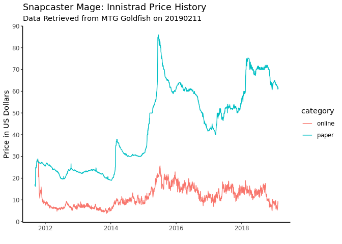

This is my work in progress for parsing MTG Goldfish pages to extract
card prices.

    suppressMessages(library(tidyverse))
    library(xml2)
    library(reticulate)
    library(devtools)
    library(roxygen2)
    library(here)
    options(tibble.print_max = Inf)
    use_python("/usr/bin/python3") #mtgsdk requires python3
    basic_lands <- c("Plains", "Island", "Swamp", "Mountain", "Forest")
    error_log_file_path <- paste0(here(),"/get_price_error_",format(Sys.Date(),"%Y_%m_%d"),".log")
    if(!file.exists(error_log_file_path)) file.create(error_log_file_path)

    load_all()

    ## Loading mtgprices

    data_dir <- "/home/john/data/mtg/"

    card_name <- "Snapcaster Mage"
    set <- "Innistrad"

    get_card_price_history(card_name, set)

    ## [1] "Snapcaster Mage"
    ## [1] "Innistrad"
    ## [1] "https://www.mtggoldfish.com/price/Innistrad/Snapcaster+Mage"

    ##            date price category
    ## 1    2011-09-07 17.16    paper
    ## 2    2011-09-08 16.68    paper
    ## 3    2011-09-09 16.70    paper
    ## 4    2011-09-10 16.55    paper
    ## 5    2011-09-11 16.50    paper
    ## 6    2011-09-12 16.36    paper
    ## 7    2011-09-13 16.25    paper
    ## 8    2011-09-14 17.19    paper
    ## 9    2011-09-15 18.98    paper
    ## 10   2011-09-16 24.65    paper
    ## 11   2011-09-17 25.08    paper
    ## 12   2011-09-18 24.85    paper
    ## 13   2011-09-19 24.54    paper
    ## 14   2011-09-20 24.72    paper
    ## 15   2011-09-21 24.91    paper
    ## 16   2011-09-22 24.75    paper
    ## 17   2011-09-23 25.21    paper
    ## 18   2011-09-24 25.84    paper
    ## 19   2011-09-25 25.64    paper
    ## 20   2011-09-26 25.66    paper
    ## 21   2011-09-27 26.99    paper
    ## 22   2011-09-28 27.65    paper
    ## 23   2011-09-29 27.94    paper
    ## 24   2011-09-30 27.82    paper
    ## 25   2011-10-01 27.68    paper
    ## 26   2011-10-02 28.10    paper
    ## 27   2011-10-03 28.51    paper
    ## 28   2011-10-04 28.40    paper
    ## 29   2011-10-05 28.43    paper
    ## 30   2011-10-06 28.11    paper
    ## 31   2011-10-07 28.01    paper
    ## 32   2011-10-09 27.79    paper
    ## 33   2011-10-10 27.81    paper
    ## 34   2011-10-11 28.95    paper
    ## 35   2011-10-12 27.49    paper
    ## 36   2011-10-13 27.32    paper
    ## 37   2011-10-14 27.08    paper
    ## 38   2011-10-15 27.05    paper
    ## 39   2011-10-16 27.34    paper
    ## 40   2011-10-17 27.41    paper
    ## 41   2011-10-18 27.54    paper
    ## 42   2011-10-19 27.19    paper
    ## 43   2011-10-20 27.08    paper
    ## 44   2011-10-21 27.12    paper
    ## 45   2011-10-22 27.15    paper
    ## 46   2011-10-23 27.34    paper
    ## 47   2011-10-24 27.41    paper
    ## 48   2011-10-25 27.39    paper
    ## 49   2011-10-26 27.20    paper
    ## 50   2011-10-27 27.09    paper
    ## 51   2011-10-28 27.02    paper
    ## 52   2011-10-29 26.99    paper
    ## 53   2011-10-30 27.05    paper
    ## 54   2011-10-31 27.01    paper
    ## 55   2011-11-01 26.93    paper
    ## 56   2011-11-02 26.89    paper
    ## 57   2011-11-03 26.92    paper
    ## 58   2011-11-04 26.63    paper
    ## 59   2011-11-05 26.79    paper
    ## 60   2011-11-06 26.78    paper
    ## 61   2011-11-07 26.79    paper
    ## 62   2011-11-08 26.78    paper
    ## 63   2011-11-09 26.83    paper
    ## 64   2011-11-10 26.79    paper
    ## 65   2011-11-11 26.79    paper
    ## 66   2011-11-12 26.80    paper
    ## 67   2011-11-13 26.92    paper
    ## 68   2011-11-14 27.08    paper
    ## 69   2011-11-15 27.21    paper
    ## 70   2011-11-16 27.17    paper
    ## 71   2011-11-17 27.38    paper
    ## 72   2011-11-18 27.30    paper
    ## 73   2011-11-19 27.01    paper
    ## 74   2011-11-20 27.01    paper
    ## 75   2011-11-21 26.96    paper
    ## 76   2011-11-22 27.21    paper
    ## 77   2011-11-23 26.95    paper
    ## 78   2011-11-24 27.05    paper
    ## 79   2011-11-25 27.27    paper
    ## 80   2011-11-26 27.16    paper
    ## 81   2011-11-27 27.15    paper
    ## 82   2011-11-28 26.97    paper
    ## 83   2011-11-29 26.86    paper
    ## 84   2011-11-30 26.93    paper
    ## 85   2011-12-01 27.02    paper
    ## 86   2011-12-02 27.02    paper
    ## 87   2011-12-03 26.95    paper
    ## 88   2011-12-04 27.09    paper
    ## 89   2011-12-05 27.03    paper
    ## 90   2011-12-06 26.98    paper
    ## 91   2011-12-07 26.76    paper
    ## 92   2011-12-08 26.57    paper
    ## 93   2011-12-09 26.45    paper
    ## 94   2011-12-10 26.51    paper
    ## 95   2011-12-11 26.36    paper
    ## 96   2011-12-12 26.26    paper
    ## 97   2011-12-13 26.22    paper
    ## 98   2011-12-14 26.18    paper
    ## 99   2011-12-15 26.25    paper
    ## 100  2011-12-16 26.14    paper
    ## 101  2011-12-17 26.19    paper
    ## 102  2011-12-18 26.16    paper
    ## 103  2011-12-19 25.92    paper
    ## 104  2011-12-20 26.16    paper
    ## 105  2011-12-21 26.14    paper
    ## 106  2011-12-22 25.92    paper
    ## 107  2011-12-23 25.93    paper
    ## 108  2011-12-24 25.93    paper
    ## 109  2011-12-25 25.94    paper
    ## 110  2011-12-26 26.00    paper
    ## 111  2011-12-27 25.81    paper
    ## 112  2011-12-28 25.77    paper
    ## 113  2011-12-29 25.62    paper
    ## 114  2011-12-30 25.48    paper
    ## 115  2011-12-31 25.61    paper
    ## 116  2012-01-01 25.63    paper
    ## 117  2012-01-02 25.70    paper
    ## 118  2012-01-03 25.74    paper
    ## 119  2012-01-04 25.61    paper
    ## 120  2012-01-05 25.83    paper
    ## 121  2012-01-06 26.02    paper
    ## 122  2012-01-07 26.06    paper
    ## 123  2012-01-08 26.06    paper
    ## 124  2012-01-09 26.35    paper
    ## 125  2012-01-10 26.42    paper
    ## 126  2012-01-11 26.66    paper
    ## 127  2012-01-12 26.85    paper
    ## 128  2012-01-13 26.60    paper
    ## 129  2012-01-14 26.61    paper
    ## 130  2012-01-15 26.79    paper
    ## 131  2012-01-16 26.84    paper
    ## 132  2012-01-17 26.87    paper
    ## 133  2012-01-18 26.77    paper
    ## 134  2012-01-19 27.06    paper
    ## 135  2012-01-20 26.99    paper
    ## 136  2012-01-21 26.75    paper
    ## 137  2012-01-22 26.84    paper
    ## 138  2012-01-23 26.83    paper
    ## 139  2012-01-24 26.82    paper
    ## 140  2012-01-25 26.73    paper
    ## 141  2012-01-26 26.59    paper
    ## 142  2012-01-27 26.48    paper
    ## 143  2012-01-28 26.36    paper
    ## 144  2012-01-29 26.34    paper
    ## 145  2012-01-30 26.31    paper
    ## 146  2012-01-31 26.19    paper
    ## 147  2012-02-01 26.15    paper
    ## 148  2012-02-02 26.03    paper
    ## 149  2012-02-03 26.07    paper
    ## 150  2012-02-04 26.05    paper
    ## 151  2012-02-05 26.11    paper
    ## 152  2012-02-06 26.04    paper
    ## 153  2012-02-07 26.00    paper
    ## 154  2012-02-08 25.98    paper
    ## 155  2012-02-09 25.99    paper
    ## 156  2012-02-10 25.94    paper
    ## 157  2012-02-11 25.89    paper
    ## 158  2012-02-12 26.13    paper
    ## 159  2012-02-13 26.16    paper
    ## 160  2012-02-14 26.33    paper
    ## 161  2012-02-15 26.09    paper
    ## 162  2012-02-16 25.90    paper
    ## 163  2012-02-17 25.89    paper
    ## 164  2012-02-18 26.01    paper
    ## 165  2012-02-19 25.93    paper
    ## 166  2012-02-20 25.98    paper
    ## 167  2012-02-21 25.90    paper
    ## 168  2012-02-22 25.65    paper
    ## 169  2012-02-23 25.55    paper
    ## 170  2012-02-24 25.70    paper
    ## 171  2012-02-25 25.69    paper
    ## 172  2012-02-26 25.81    paper
    ## 173  2012-02-27 25.69    paper
    ## 174  2012-02-28 25.72    paper
    ## 175  2012-02-29 25.50    paper
    ## 176  2012-03-01 25.48    paper
    ## 177  2012-03-02 25.43    paper
    ## 178  2012-03-03 25.48    paper
    ## 179  2012-03-04 25.40    paper
    ## 180  2012-03-05 25.45    paper
    ## 181  2012-03-06 25.24    paper
    ## 182  2012-03-07 25.26    paper
    ## 183  2012-03-08 25.29    paper
    ## 184  2012-03-09 25.24    paper
    ## 185  2012-03-10 25.24    paper
    ## 186  2012-03-11 25.08    paper
    ## 187  2012-03-12 25.06    paper
    ## 188  2012-03-13 25.05    paper
    ## 189  2012-03-14 25.07    paper
    ## 190  2012-03-15 25.08    paper
    ## 191  2012-03-16 24.91    paper
    ## 192  2012-03-17 24.70    paper
    ## 193  2012-03-18 24.68    paper
    ## 194  2012-03-19 24.63    paper
    ## 195  2012-03-20 24.76    paper
    ## 196  2012-03-21 23.95    paper
    ## 197  2012-03-22 24.24    paper
    ## 198  2012-03-23 24.47    paper
    ## 199  2012-03-24 24.30    paper
    ## 200  2012-03-25 24.37    paper
    ## 201  2012-03-26 24.34    paper
    ## 202  2012-03-27 24.23    paper
    ## 203  2012-03-28 24.12    paper
    ## 204  2012-03-29 24.10    paper
    ## 205  2012-03-30 24.03    paper
    ## 206  2012-03-31 23.96    paper
    ## 207  2012-04-01 24.00    paper
    ## 208  2012-04-02 24.16    paper
    ## 209  2012-04-03 24.10    paper
    ## 210  2012-04-04 24.13    paper
    ## 211  2012-04-05 24.08    paper
    ## 212  2012-04-06 24.17    paper
    ## 213  2012-04-07 24.15    paper
    ## 214  2012-04-08 24.20    paper
    ## 215  2012-04-09 24.29    paper
    ## 216  2012-04-10 24.27    paper
    ## 217  2012-04-11 24.19    paper
    ## 218  2012-04-12 24.23    paper
    ## 219  2012-04-13 24.15    paper
    ## 220  2012-04-14 24.17    paper
    ## 221  2012-04-15 24.24    paper
    ## 222  2012-04-16 24.12    paper
    ## 223  2012-04-17 23.99    paper
    ## 224  2012-04-18 23.95    paper
    ## 225  2012-04-19 23.94    paper
    ## 226  2012-04-20 23.75    paper
    ## 227  2012-04-21 23.78    paper
    ## 228  2012-04-22 23.68    paper
    ## 229  2012-04-23 23.38    paper
    ## 230  2012-04-24 23.43    paper
    ## 231  2012-04-25 23.44    paper
    ## 232  2012-04-26 23.32    paper
    ## 233  2012-04-27 23.33    paper
    ## 234  2012-04-28 23.36    paper
    ## 235  2012-04-29 23.41    paper
    ## 236  2012-04-30 23.41    paper
    ## 237  2012-05-01 23.49    paper
    ## 238  2012-05-02 23.48    paper
    ## 239  2012-05-03 23.30    paper
    ## 240  2012-05-04 23.27    paper
    ## 241  2012-05-05 23.17    paper
    ## 242  2012-05-06 23.16    paper
    ## 243  2012-05-07 23.21    paper
    ## 244  2012-05-08 23.17    paper
    ## 245  2012-05-09 23.04    paper
    ## 246  2012-05-10 23.24    paper
    ## 247  2012-05-11 23.23    paper
    ## 248  2012-05-12 23.33    paper
    ## 249  2012-05-13 23.29    paper
    ## 250  2012-05-14 23.21    paper
    ## 251  2012-05-15 23.14    paper
    ## 252  2012-05-16 22.95    paper
    ## 253  2012-05-17 22.74    paper
    ## 254  2012-05-18 22.77    paper
    ## 255  2012-05-19 22.77    paper
    ## 256  2012-05-20 23.00    paper
    ## 257  2012-05-21 22.91    paper
    ## 258  2012-05-22 22.77    paper
    ## 259  2012-05-23 22.62    paper
    ## 260  2012-05-24 22.48    paper
    ## 261  2012-05-25 22.72    paper
    ## 262  2012-05-26 22.67    paper
    ## 263  2012-05-27 22.63    paper
    ## 264  2012-05-28 22.52    paper
    ## 265  2012-05-29 22.30    paper
    ## 266  2012-05-30 22.10    paper
    ## 267  2012-05-31 22.01    paper
    ## 268  2012-06-01 22.20    paper
    ## 269  2012-06-02 22.00    paper
    ## 270  2012-06-03 22.07    paper
    ## 271  2012-06-04 21.89    paper
    ## 272  2012-06-05 21.73    paper
    ## 273  2012-06-06 21.45    paper
    ## 274  2012-06-07 21.51    paper
    ## 275  2012-06-08 21.46    paper
    ## 276  2012-06-09 21.33    paper
    ## 277  2012-06-10 21.35    paper
    ## 278  2012-06-11 21.11    paper
    ## 279  2012-06-12 20.90    paper
    ## 280  2012-06-13 20.77    paper
    ## 281  2012-06-14 20.80    paper
    ## 282  2012-06-15 20.66    paper
    ## 283  2012-06-16 20.44    paper
    ## 284  2012-06-17 20.29    paper
    ## 285  2012-06-18 20.17    paper
    ## 286  2012-06-19 20.37    paper
    ## 287  2012-06-20 20.50    paper
    ## 288  2012-06-21 20.28    paper
    ## 289  2012-06-22 20.02    paper
    ## 290  2012-06-23 19.83    paper
    ## 291  2012-06-24 19.91    paper
    ## 292  2012-06-25 19.98    paper
    ## 293  2012-06-26 19.87    paper
    ## 294  2012-06-27 19.85    paper
    ## 295  2012-06-28 19.77    paper
    ## 296  2012-06-29 19.88    paper
    ## 297  2012-06-30 19.88    paper
    ## 298  2012-07-01 19.87    paper
    ## 299  2012-07-02 19.91    paper
    ## 300  2012-07-03 19.94    paper
    ## 301  2012-07-04 19.89    paper
    ## 302  2012-07-05 19.86    paper
    ## 303  2012-07-06 19.70    paper
    ## 304  2012-07-07 19.61    paper
    ## 305  2012-07-08 19.55    paper
    ## 306  2012-07-09 19.63    paper
    ## 307  2012-07-10 19.69    paper
    ## 308  2012-07-11 19.66    paper
    ## 309  2012-07-12 19.74    paper
    ## 310  2012-07-13 19.77    paper
    ## 311  2012-07-14 19.83    paper
    ## 312  2012-07-15 19.78    paper
    ## 313  2012-07-16 19.85    paper
    ## 314  2012-07-17 19.77    paper
    ## 315  2012-07-18 19.64    paper
    ## 316  2012-07-19 19.62    paper
    ## 317  2012-07-20 19.77    paper
    ## 318  2012-07-21 19.71    paper
    ## 319  2012-07-22 19.82    paper
    ## 320  2012-07-23 19.97    paper
    ## 321  2012-07-24 19.91    paper
    ## 322  2012-07-25 19.84    paper
    ## 323  2012-07-26 20.94    paper
    ## 324  2012-07-27 19.76    paper
    ## 325  2012-07-28 19.77    paper
    ## 326  2012-07-29 19.83    paper
    ## 327  2012-07-30 19.93    paper
    ## 328  2012-07-31 19.94    paper
    ## 329  2012-08-01 19.87    paper
    ## 330  2012-08-02 19.80    paper
    ## 331  2012-08-03 19.72    paper
    ## 332  2012-08-04 19.74    paper
    ## 333  2012-08-05 19.73    paper
    ##  [ reached getOption("max.print") -- omitted 4931 rows ]

    plot_card_price_history(card_name, set) %>% plot

    ## [1] "Snapcaster Mage"
    ## [1] "Innistrad"
    ## [1] "https://www.mtggoldfish.com/price/Innistrad/Snapcaster+Mage"

    write_card_price_history(card_name = card_name, 
                             set = set,
                             directory = data_dir)

    ## [1] "Snapcaster Mage"
    ## [1] "Innistrad"
    ## [1] "https://www.mtggoldfish.com/price/Innistrad/Snapcaster+Mage"

    extract_card_info <- function(card) {
      if (!identical(class(card),c("mtgsdk.card.Card", "python.builtin.object")))
        stop("Input is not of the correct class, c(\"mtgsdk.card.Card\", \"python.builtin.object\").")
      list(name          = card$name,
           set_code      = card$set,
           set_name      = card$set_name,
           layout        = card$layout,
           number        = card$number,
           has_alt_names = !is.null(card$names) & length(card$names) > 1)
    }

    mtgsdk <- import("mtgsdk")
    card_dat <- mtgsdk$Card$all()

    #Already saved, no need to rerun.
    card_dat_parsed <- card_dat %>% 
      map_df(~list(name = .x$name, 
                   type = .x$type,
                   set_name = .x$set_name, 
                   number = ifelse(is.null(.x$number), NA_character_, .x$number),
                   layout = .x$layout,
                   has_alt_names = !is.null(.x$names) & length(.x$names) > 1 ,
                   has_variations = !is.null(.x$variations) & length(.x$variations) > 0)) %>% 
      mutate(split_num = str_extract_all(number,"[0-9]+",simplify=TRUE)) %>% 
      group_by(set_name, split_num) %>% 
      #mutate(split_names = case_when(all(layout == "split", (set_name %in% expansion_sets) | (set_name %in% core_sets)) ~ paste0(name, collapse = " "), TRUE ~ ""))
      mutate(split_name = case_when(layout == "split" ~ paste0(name, collapse = " "), TRUE ~ NA_character_)) %>% 
      mutate(lookup_name = coalesce(split_name, name)) %>% 
      ungroup

    saveRDS(card_dat_parsed, file = "card_dat.RDS")

    no_go_sets <- read_tsv(file = "no_go_sets.tsv", col_names = "set", col_types = list(col_character())) %>% unlist
    core_sets <- read_tsv(file = "core_sets.tsv", col_names = "set", col_types = list(col_character())) %>% unlist
    expansion_sets <- read_tsv(file = "expansion_sets.tsv", col_names = "set", col_types = list(col_character())) %>% unlist

    card_dat_parsed <- readRDS("card_dat.RDS")

    all_sets <- card_dat_parsed %>% distinct(set_name) %>% arrange(set_name) %>% unlist(use.names = FALSE)
    all_sets

    ##   [1] "15th Anniversary"                        
    ##   [2] "Aether Revolt"                           
    ##   [3] "Alara Reborn"                            
    ##   [4] "Alliances"                               
    ##   [5] "Amonkhet"                                
    ##   [6] "Anthologies"                             
    ##   [7] "Antiquities"                             
    ##   [8] "Apocalypse"                              
    ##   [9] "Arabian Nights"                          
    ##  [10] "Archenemy"                               
    ##  [11] "Archenemy: Nicol Bolas"                  
    ##  [12] "Arena League"                            
    ##  [13] "Asia Pacific Land Program"               
    ##  [14] "Avacyn Restored"                         
    ##  [15] "Battle for Zendikar"                     
    ##  [16] "Battle Royale Box Set"                   
    ##  [17] "Beatdown Box Set"                        
    ##  [18] "Betrayers of Kamigawa"                   
    ##  [19] "Born of the Gods"                        
    ##  [20] "Celebration"                             
    ##  [21] "Champions of Kamigawa"                   
    ##  [22] "Champs and States"                       
    ##  [23] "Chronicles"                              
    ##  [24] "Classic Sixth Edition"                   
    ##  [25] "Coldsnap"                                
    ##  [26] "Coldsnap Theme Decks"                    
    ##  [27] "Collector's Edition"                     
    ##  [28] "Commander 2013 Edition"                  
    ##  [29] "Commander 2014"                          
    ##  [30] "Commander 2015"                          
    ##  [31] "Commander 2016"                          
    ##  [32] "Commander 2017"                          
    ##  [33] "Commander Anthology"                     
    ##  [34] "Commander's Arsenal"                     
    ##  [35] "Conflux"                                 
    ##  [36] "Conspiracy: Take the Crown"              
    ##  [37] "Dark Ascension"                          
    ##  [38] "Darksteel"                               
    ##  [39] "Deckmasters"                             
    ##  [40] "Dissension"                              
    ##  [41] "Dragon Con"                              
    ##  [42] "Dragon's Maze"                           
    ##  [43] "Dragons of Tarkir"                       
    ##  [44] "Duel Decks Anthology, Divine vs. Demonic"
    ##  [45] "Duel Decks Anthology, Elves vs. Goblins" 
    ##  [46] "Duel Decks Anthology, Garruk vs. Liliana"
    ##  [47] "Duel Decks Anthology, Jace vs. Chandra"  
    ##  [48] "Duel Decks: Ajani vs. Nicol Bolas"       
    ##  [49] "Duel Decks: Blessed vs. Cursed"          
    ##  [50] "Duel Decks: Divine vs. Demonic"          
    ##  [51] "Duel Decks: Elspeth vs. Kiora"           
    ##  [52] "Duel Decks: Elspeth vs. Tezzeret"        
    ##  [53] "Duel Decks: Elves vs. Goblins"           
    ##  [54] "Duel Decks: Garruk vs. Liliana"          
    ##  [55] "Duel Decks: Heroes vs. Monsters"         
    ##  [56] "Duel Decks: Izzet vs. Golgari"           
    ##  [57] "Duel Decks: Jace vs. Chandra"            
    ##  [58] "Duel Decks: Jace vs. Vraska"             
    ##  [59] "Duel Decks: Knights vs. Dragons"         
    ##  [60] "Duel Decks: Merfolk vs. Goblins"         
    ##  [61] "Duel Decks: Mind vs. Might"              
    ##  [62] "Duel Decks: Nissa vs. Ob Nixilis"        
    ##  [63] "Duel Decks: Phyrexia vs. the Coalition"  
    ##  [64] "Duel Decks: Sorin vs. Tibalt"            
    ##  [65] "Duel Decks: Speed vs. Cunning"           
    ##  [66] "Duel Decks: Venser vs. Koth"             
    ##  [67] "Duel Decks: Zendikar vs. Eldrazi"        
    ##  [68] "Duels of the Planeswalkers"              
    ##  [69] "Eighth Edition"                          
    ##  [70] "Eldritch Moon"                           
    ##  [71] "Eternal Masters"                         
    ##  [72] "European Land Program"                   
    ##  [73] "Eventide"                                
    ##  [74] "Exodus"                                  
    ##  [75] "Explorers of Ixalan"                     
    ##  [76] "Fallen Empires"                          
    ##  [77] "Fate Reforged"                           
    ##  [78] "Fate Reforged Clash Pack"                
    ##  [79] "Fifth Dawn"                              
    ##  [80] "Fifth Edition"                           
    ##  [81] "Fourth Edition"                          
    ##  [82] "Friday Night Magic"                      
    ##  [83] "From the Vault: Angels"                  
    ##  [84] "From the Vault: Annihilation (2014)"     
    ##  [85] "From the Vault: Dragons"                 
    ##  [86] "From the Vault: Exiled"                  
    ##  [87] "From the Vault: Legends"                 
    ##  [88] "From the Vault: Lore"                    
    ##  [89] "From the Vault: Realms"                  
    ##  [90] "From the Vault: Relics"                  
    ##  [91] "From the Vault: Transform"               
    ##  [92] "From the Vault: Twenty"                  
    ##  [93] "Future Sight"                            
    ##  [94] "Gatecrash"                               
    ##  [95] "Gateway"                                 
    ##  [96] "Grand Prix"                              
    ##  [97] "Guildpact"                               
    ##  [98] "Guru"                                    
    ##  [99] "Happy Holidays"                          
    ## [100] "Homelands"                               
    ## [101] "Hour of Devastation"                     
    ## [102] "Ice Age"                                 
    ## [103] "Iconic Masters"                          
    ## [104] "Innistrad"                               
    ## [105] "International Collector's Edition"       
    ## [106] "Introductory Two-Player Set"             
    ## [107] "Invasion"                                
    ## [108] "Ixalan"                                  
    ## [109] "Journey into Nyx"                        
    ## [110] "Judge Gift Program"                      
    ## [111] "Judgment"                                
    ## [112] "Kaladesh"                                
    ## [113] "Khans of Tarkir"                         
    ## [114] "Launch Parties"                          
    ## [115] "Legend Membership"                       
    ## [116] "Legends"                                 
    ## [117] "Legions"                                 
    ## [118] "Limited Edition Alpha"                   
    ## [119] "Limited Edition Beta"                    
    ## [120] "Lorwyn"                                  
    ## [121] "Magic 2010"                              
    ## [122] "Magic 2011"                              
    ## [123] "Magic 2012"                              
    ## [124] "Magic 2013"                              
    ## [125] "Magic 2014 Core Set"                     
    ## [126] "Magic 2015 Clash Pack"                   
    ## [127] "Magic 2015 Core Set"                     
    ## [128] "Magic Game Day"                          
    ## [129] "Magic Origins"                           
    ## [130] "Magic Origins Clash Pack"                
    ## [131] "Magic Player Rewards"                    
    ## [132] "Magic: The Gathering-Commander"          
    ## [133] "Magic: The Gathering—Conspiracy"         
    ## [134] "Masterpiece Series: Amonkhet Invocations"
    ## [135] "Masterpiece Series: Kaladesh Inventions" 
    ## [136] "Masters 25"                              
    ## [137] "Masters Edition"                         
    ## [138] "Masters Edition II"                      
    ## [139] "Masters Edition III"                     
    ## [140] "Masters Edition IV"                      
    ## [141] "Media Inserts"                           
    ## [142] "Mercadian Masques"                       
    ## [143] "Mirage"                                  
    ## [144] "Mirrodin"                                
    ## [145] "Mirrodin Besieged"                       
    ## [146] "Modern Event Deck 2014"                  
    ## [147] "Modern Masters"                          
    ## [148] "Modern Masters 2015 Edition"             
    ## [149] "Modern Masters 2017 Edition"             
    ## [150] "Morningtide"                             
    ## [151] "Multiverse Gift Box"                     
    ## [152] "Nemesis"                                 
    ## [153] "New Phyrexia"                            
    ## [154] "Ninth Edition"                           
    ## [155] "Oath of the Gatewatch"                   
    ## [156] "Odyssey"                                 
    ## [157] "Onslaught"                               
    ## [158] "Planar Chaos"                            
    ## [159] "Planechase"                              
    ## [160] "Planechase 2012 Edition"                 
    ## [161] "Planechase Anthology"                    
    ## [162] "Planeshift"                              
    ## [163] "Portal"                                  
    ## [164] "Portal Demo Game"                        
    ## [165] "Portal Second Age"                       
    ## [166] "Portal Three Kingdoms"                   
    ## [167] "Premium Deck Series: Fire and Lightning" 
    ## [168] "Premium Deck Series: Graveborn"          
    ## [169] "Premium Deck Series: Slivers"            
    ## [170] "Prerelease Events"                       
    ## [171] "Pro Tour"                                
    ## [172] "Prophecy"                                
    ## [173] "Ravnica: City of Guilds"                 
    ## [174] "Release Events"                          
    ## [175] "Return to Ravnica"                       
    ## [176] "Revised Edition"                         
    ## [177] "Rise of the Eldrazi"                     
    ## [178] "Rivals of Ixalan"                        
    ## [179] "Rivals Quick Start Set"                  
    ## [180] "Saviors of Kamigawa"                     
    ## [181] "Scars of Mirrodin"                       
    ## [182] "Scourge"                                 
    ## [183] "Seventh Edition"                         
    ## [184] "Shadowmoor"                              
    ## [185] "Shadows over Innistrad"                  
    ## [186] "Shards of Alara"                         
    ## [187] "Starter 1999"                            
    ## [188] "Starter 2000"                            
    ## [189] "Stronghold"                              
    ## [190] "Summer of Magic"                         
    ## [191] "Super Series"                            
    ## [192] "Tempest"                                 
    ## [193] "Tempest Remastered"                      
    ## [194] "Tenth Edition"                           
    ## [195] "The Dark"                                
    ## [196] "Theros"                                  
    ## [197] "Time Spiral"                             
    ## [198] "Time Spiral \"Timeshifted\""             
    ## [199] "Torment"                                 
    ## [200] "Two-Headed Giant Tournament"             
    ## [201] "Ugin's Fate promos"                      
    ## [202] "Unglued"                                 
    ## [203] "Unhinged"                                
    ## [204] "Unlimited Edition"                       
    ## [205] "Unstable"                                
    ## [206] "Urza's Destiny"                          
    ## [207] "Urza's Legacy"                           
    ## [208] "Urza's Saga"                             
    ## [209] "Vanguard"                                
    ## [210] "Vintage Masters"                         
    ## [211] "Visions"                                 
    ## [212] "Weatherlight"                            
    ## [213] "Welcome Deck 2016"                       
    ## [214] "Welcome Deck 2017"                       
    ## [215] "Wizards of the Coast Online Store"       
    ## [216] "Wizards Play Network"                    
    ## [217] "World Magic Cup Qualifiers"              
    ## [218] "Worlds"                                  
    ## [219] "Worldwake"                               
    ## [220] "Zendikar"                                
    ## [221] "Zendikar Expeditions"

    all(no_go_sets %in% all_sets)

    ## [1] TRUE

    all(core_sets %in% all_sets)

    ## [1] TRUE

    all(expansion_sets %in% all_sets)

    ## [1] TRUE

    trial_dat <- card_dat_parsed %>% 
      #filter(!(set_name %in% no_go_sets)) %>% 
      #filter(!(set_name %in% c("Unglued", "Unhinged", "Unstable"))) %>% #Exclude to start with for simplicity.
      filter((set_name %in% expansion_sets) | (set_name %in% core_sets)) %>% 
      filter(!has_alt_names | str_detect(number, "^[0-9]+$|^[0-9]+a$")) %>% 
      filter(!(name %in% basic_lands) | (set_name %in% c("Unglued", "Unhinged", "Unstable"))) %>% 
      filter((type != "Conspiracy") | (set_name != "Magic: The Gathering—Conspiracy")) %>% #Goldfish doesn't include conspiracies from CNS either.
      filter(!has_variations) %>% #Figure this out later. This is for cards like Fallen Empires Hymn to Tourach or Alliances Arcane Denial.
      filter(name != "Kongming, \"Sleeping Dragon\"") %>% #For some reason many of their Kongming links are broken.
      filter((name != "Phage the Untouchable Avatar") | (set_name != "Vanguard")) %>% #No price history available.
      filter(!(type %in% c("Scheme", "Ongoing Scheme"))) %>% #No prices.
      sample_n(100)

    safely_write_card_price_history <- safely(write_card_price_history)
    error_behavior <- function(message) {write(toString(message), error_log_file_path, append=TRUE)}

    tryCatch({
      trial_dat %>%
        select(name, set_name) %>% 
        pwalk(~ write_card_price_history(card_name = ..1, set = ..2, directory = data_dir))
      }, error = error_behavior
    )

Some cards with multiple names have exceptions to note: \* Who What When
Where Why
